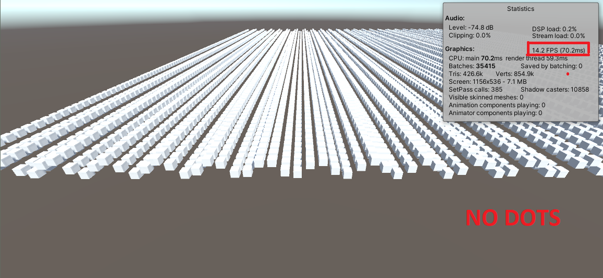
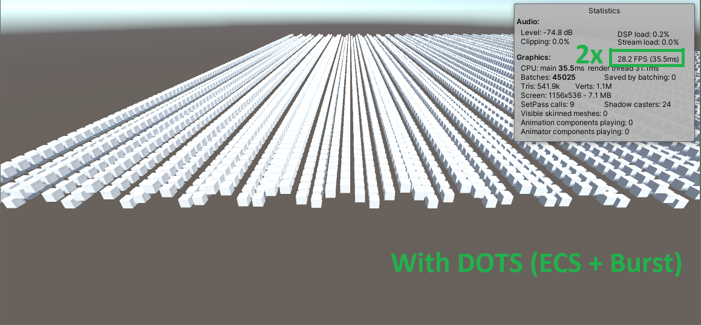

# DOTS Entities Test Project

I created this simple project where I instantiate 100 game objects and change their position every frame with a sinus function to try out Unity's Entity Component System and the Burst compiler.

At first I programmed this by using game objects and a Monobehaviour script to change their positions.



Afterwards I made the script instantiate entities instead of game objects and created a system script inheriting from "SystemBase" to move them around which resulted in a 2x improvement in performance in terms of FPS as seen below.



## Reflection on the exercise

### Main Problem - Compatibility and Versions

I got stuck on figuring out which version of Unity I should use in combination with which version of the DOTS pacakages and which tutorials or documentation to use so that it all works together.

#### **Solution**

Use the 2020 LTS version of the Unity Editor, then add the "Entities", "Hybrid Renderer" and the "DOTS Editor" packages through the Package Manager by clicking on the plus sign, clicking on "Add package from git URL..." and paste the following name "com.unity.entities" of the package into the input field and click "Add" afterwards, then do the same for the following package names "com.unity.rendering.hybrid" and "com.unity.dots.editor".

Make sure to use the _Unity 2020.3.20f1 LTS_ editor, if you use _Unity 2021.1_ or newer the entities packag is not compatible with it, if you use an older version for example _Unity 2019.2.18f1_ then the packages available in the Package Manager will not be up to date and the newest tutorials and the documentation will not help you. I tried both of the wrong versions before I used the correct one.

Sources:

- [Explanation of the compatibility issues by Unity on the forum](https://forum.unity.com/threads/notice-on-dots-compatibility-with-unity-2021-1.1091800/)
- [DOTS Project Setup](https://docs.unity3d.com/Packages/com.unity.entities@0.17/manual/install_setup.html)
- [List of importable DOTS packages to Unity 2020 LTS (by name "com.unity...")](https://forum.unity.com/threads/dots-releases-latest-release-dots-0-17.1044523/)

### C# 7.2 syntax not supported

When I was following the [Entities documentation](https://docs.unity3d.com/Packages/com.unity.entities@0.17/manual/ecs_creating_systems.html) explaining how to create an ECS system script, I ran into a syntax error in the following code for updating the positions of my entities:

```C#
public class FloatingSystem : SystemBase
{
	protected override void OnUpdate()
	{
		float currentTime = UnityEngine.Time.time;

		Entities.ForEach((ref LocalToWorld localToWorld, in FloatingObjectData floatingObjectData) =>
		{
			Quaternion rotation = localToWorld.Rotation;

			float3 position = localToWorld.Position;
			position.y = (float) Math.Sin(currentTime + position.x);

			localToWorld.Value = new float4x4(rotation, position);
		}).ScheduleParallel();
	}
}
```

VisualStudio 2019 announced that I cannot use the "in" keyword because it is a feature of C# 7.2 and above.

#### **Solution**

I navigated to "Edit" > "Project Settings" > "Player" and changed the "Api compatibility level" from ".NET Standard 2.0" to ".NET 4.x" which resolved the problem. My solution was inspired by this [StackOverflow post](https://stackoverflow.com/questions/45578298/how-to-enable-c-sharp-7-features-on-unity3d-projects) which also suggests modification of these settings.

## Used Versions

|                       |                   |
| --------------------- | ----------------- |
| **Unity:**            | 2020.3.20f1 LTS   |
| **Entities package:** | 0.17.0-preview.42 |
| **Hybrid renderer:**  | 0.11.0-preview.44 |
| **DOTS Editor:**      | 0.12.0-preview.6  |


## Controls (in Play Mode)

- Pressing "S" - Instantiates game objects animated by a MonoBehaviour.
- Pressing "D" - Destroys the spawned game objects.
- Pressing "E" - Spawns entities animated by an ECS system script.
- TODO - Key binding and functionality for destroying entities.
